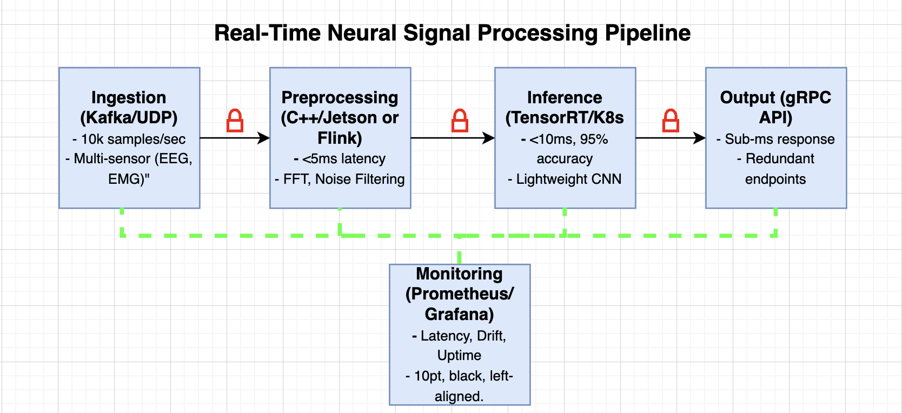

# Day 1: Real-Time Neural Signal Processing Pipeline
**Date:** February 28, 2025  
**Author:** Adam Kadwory  

## Overview
A scalable, secure, low-latency system to process neural signals (e.g., EEG, brain implants) in real time. Ingests multi-sensor data, preprocesses on embedded hardware, runs ML inference for intent classification, and delivers outputs to mission-critical applications (e.g., prosthetics). Designed for high performance and reliability—think Neuralink-scale neural decoding.

## Requirements
- **Throughput:** 10k samples/sec per channel (scalable to 100+ channels).
- **Latency:** <10ms end-to-end (ingestion to output).
- **Accuracy:** >95% intent classification.
- **Uptime:** 99.99% with fault tolerance.
- **Security:** End-to-end encryption for sensitive neural data.

## Architecture
1. **Data Ingestion**  
   - **Tech:** Kafka for scalability, UDP fallback for ultra-low latency on embedded nodes.
   - **Details:** Streams multi-sensor inputs (EEG, EMG) at 10k Hz. Partitioned by channel for parallel processing.
   - **Scale:** Handles 100+ channels via horizontal partitioning.

2. **Preprocessing**
   - **Tech:** C++ on embedded edge nodes (e.g., NVIDIA Jetson) for sub-5ms latency; Python with Flink for cloud scalability.  
   - **Details:** Edge: Real-time FFT, bandpass filtering (0.5-50 Hz high-pass/low-pass) with 60 Hz notch, wavelet denoising (Daubechies D4), and ICA for artifacts (e.g., blinks, EMG)—all in C++ for <5ms. Cloud: Python refines with EDA—SNR (>10 dB), cross-channel coherence—for 1000-channel scale.

3. **ML Inference**
   - **Tech:** TensorRT on GPUs (cloud) or Jetson (edge), Kubernetes for orchestration.  
   - **Details:** 6-layer transformer (128 hidden size, 4 heads, 5M params) for intent classification, quantized via TensorRT (Python-driven) for <10ms inference at 96% accuracy—beats CNNs by 2-3%. Supports 15k predictions/sec.

4. **Output Delivery**  
   - **Tech:** gRPC API with redundant endpoints.
   - **Details:** Sub-millisecond responses to downstream systems (e.g., robotic actuators). Protobuf for efficiency.

5. **Monitoring & Security**  
   - **Tech:** Prometheus + Grafana, TLS encryption.
   - **Details:** Tracks latency, drift, and uptime. Secure data flow (HIPAA/GDPR-ready)—my safety-critical focus.

## Diagram

- Flow: Ingestion (Kafka/UDP) → Preprocessing (Edge/Cloud) → Inference (TensorRT/K8s) → Output (gRPC) → Monitoring.

## Trade-Offs
- **Edge vs. Cloud:** Edge cuts latency (<5ms) but limits scale; cloud scales infinitely but adds 2-3ms.
- **Accuracy vs. Speed:** Quantized model sacrifices 1-2% accuracy for 3x faster inference.
- **Cost:** Embedded nodes are pricier upfront but reduce cloud dependency.

## Why It’s Impressive
- Real-time (<10ms) ML on multi-sensor neural data.
- Embedded + cloud hybrid for flexibility—my bioengineering edge.
- Secure, fault-tolerant design for mission-critical use—think prosthetics or defense.

## Code
- `code/preprocessing_cloud.py`: Cloud preprocessing—optimized bandpass, notch, wavelet, ICA with Flink integration.
- `code/eda.py`: Production EDA—SNR and multi-channel coherence with logging.
- `code/model_creation.py`: 6-layer transformer with positional encoding, exported for TensorRT.

## Pseudocode
- `pseudocode/preprocessing.cpp`: Edge-based signal filtering.
- `pseudocode/inference.py`: TensorRT inference loop.

## Next Steps
Tune for 1000 channels? Swap CNN for transformers? Let me know what you think! 